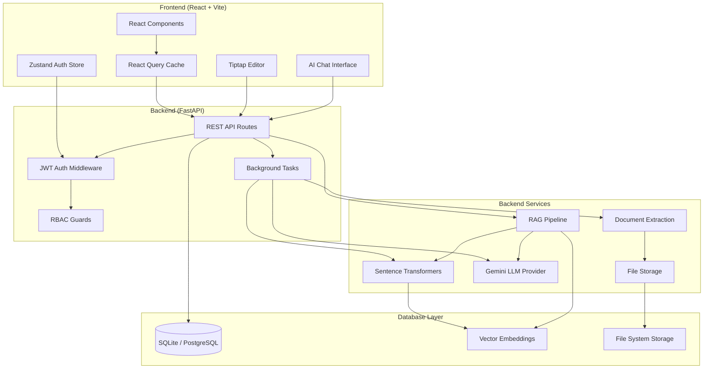
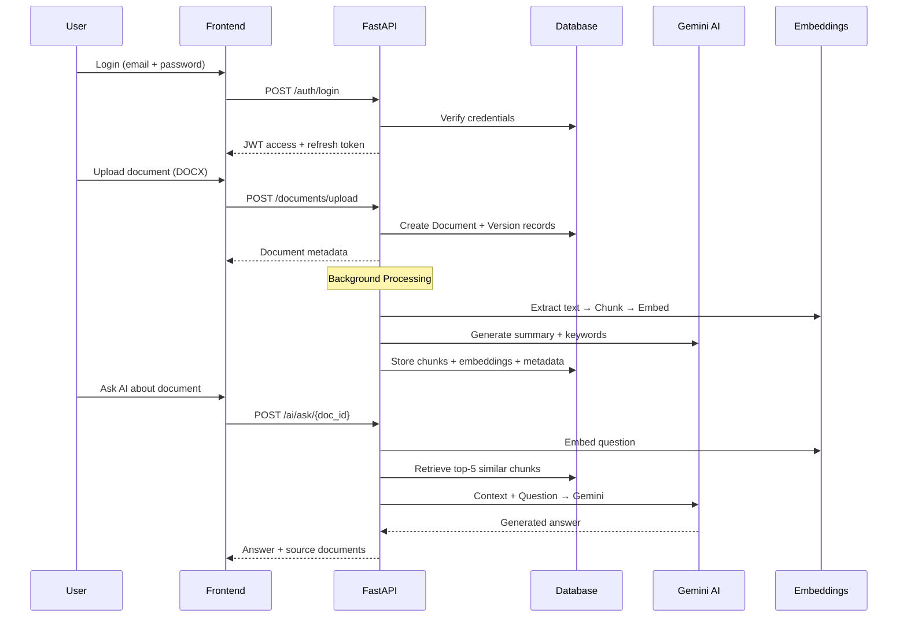
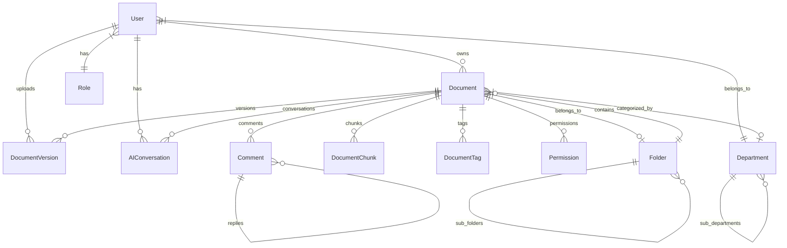

<p align="center">
  <h1 align="center">🏢 AI-Powered Enterprise Knowledge &amp; Document Management System</h1>
  <p align="center">
    <em>An intelligent enterprise document workspace with hierarchical document management, rich Tiptap editing, RBAC, persistent storage, and RAG-powered AI assistance.</em>
  </p>
</p>

<p align="center">
  
  
  
  
  
  
  
  
</p>

<p align="center">
  <a href="#-key-features">Features</a> •
  <a href="#-system-architecture">Architecture</a> •
  <a href="#-technology-stack">Tech Stack</a> •
  <a href="#-installation">Installation</a> •
  <a href="#-ai-document-assistant">AI Assistant</a> •
  <a href="#-rich-document-editor">Editor</a>
</p>

---

## 📋 Project Overview

The **AI-Powered Enterprise Knowledge & Document Management System** is a full-stack enterprise document workspace designed for corporate teams. It combines hierarchical folder-based document management, a custom paginated rich-text editor built on Tiptap/ProseMirror, role-based access control (RBAC), and an integrated AI Document Assistant powered by Google Gemini and a Retrieval-Augmented Generation (RAG) pipeline.

> **Audit-verified (Aug 2026):** Core flows — login, document CRUD, upload, autosave, version checkpoints, and AI Q&A — are backed by real FastAPI endpoints and Gemini/RAG integration. Some UI surfaces remain demo/mock (see [Known Limitations](#-known-limitations)).

---

## 🎯 Problem Statement

Modern enterprises manage thousands of documents across departments — handbooks, policies, reports, presentations, and compliance records. Existing solutions often lack:

- **Intelligent search** that understands content semantics, not just keywords
- **AI-powered assistance** scoped to specific documents for contextual Q&A
- **Rich editing** with proper pagination that mimics printed page layout
- **Granular access control** at user, department, and document level
- **Unified upload pipeline** supporting multiple formats with automatic processing

---

## 💡 Solution

This system addresses all of the above through a three-tier architecture:

1. **React Frontend** — Enterprise UI with document workspace, folder tree, and paginated Tiptap editor
2. **FastAPI Backend** — RESTful API with JWT authentication, RBAC, and document lifecycle management
3. **RAG-Powered AI** — Sentence Transformer embeddings + Gemini LLM for context-aware document assistance

---

## ✨ Key Features

<table>
<tr>
<td width="50%">

### 📁 Document Management
- Hierarchical folder tree with drag-and-drop organization
- Multi-format upload (DOCX, PDF, PPTX, XLSX, TXT)
- Version history with checkpoint creation
- Document archival, restore, and favorites
- Template management system
- Approval workflow (submit → review → approve/reject)
- Public document sharing via unique links

</td>
<td width="50%">

### 🤖 AI Document Assistant
- Organization-wide knowledge Q&A
- Document-scoped contextual questions
- Selection-based text transformations (improve, rewrite, shorten, expand)
- Tone adjustment (professional rewriting)
- AI-generated summaries and keywords on upload
- Related document discovery via embedding similarity
- Conversation history persistence

</td>
</tr>
<tr>
<td>

### ✏️ Rich Document Editor
- Custom paginated Tiptap editor (fixed 920×1056 page sheets)
- Automatic content overflow to next page
- Manual page breaks (Cmd/Ctrl+Enter)
- Full formatting toolbar (fonts, colors, alignment, spacing)
- Tables, images (resizable), links, blockquotes
- Headings (H1–H4), bullet/numbered lists, indent/outdent
- Autosave with debounced persistence
- Undo/redo with full edit history

</td>
<td>

### 🔐 Security & Access Control
- JWT authentication with httpOnly refresh cookies
- Token blacklisting on logout
- Role-based access control (Super Admin, Admin, Manager, Employee, Guest)
- Department-level and user-level document permissions
- Protected API routes with middleware guards
- Corporate invite code for registration
- Server-side audit logging (stdout) for auth, permissions, and document lifecycle events

</td>
</tr>
</table>

---

## 🏗 System Architecture



---

## 🔧 Technology Stack

### Frontend

| Technology | Version | Purpose |
|---|---|---|
| React | 18.3 | UI component framework |
| TypeScript | 5.5 | Type-safe development |
| Vite | 5.3 | Build tool and dev server |
| Tailwind CSS | 3.4 | Utility-first styling |
| React Query | 5.50 | Server state management and caching |
| Zustand | 4.5 | Lightweight client state (auth) |
| Tiptap | 3.29 | ProseMirror-based rich text editor |
| Lucide React | 1.23 | Icon library |
| React Router | 6.24 | Client-side routing |

### Backend

| Technology | Version | Purpose |
|---|---|---|
| FastAPI | 0.111 | Async REST API framework |
| SQLAlchemy | 2.0 | ORM with async support |
| Alembic | 1.13 | Database migrations |
| Pydantic | 2.12 | Request/response validation |
| python-jose | 3.3 | JWT token management |
| passlib[bcrypt] | 1.7 | Password hashing |
| uvicorn | 0.30 | ASGI server |

### AI & Document Processing

| Technology | Version | Purpose |
|---|---|---|
| google-genai | 2.17 | Gemini LLM integration |
| Sentence Transformers | 3.0 | Local embedding generation (all-MiniLM-L6-v2) |
| PyMuPDF (fitz) | 1.24 | PDF text extraction |
| python-docx | 1.1 | DOCX text extraction |
| mammoth | 1.11 | DOCX → HTML conversion for editor |
| python-pptx | 0.6 | PPTX text extraction |
| openpyxl | 3.1 | XLSX text extraction |
| pytesseract | 0.3 | OCR for image documents |
| NumPy | 1.26 | Vector similarity computations |

### Database

| Environment | Engine | Vector Support |
|---|---|---|
| Development | SQLite | In-memory cosine similarity (NumPy fallback) |
| Production | PostgreSQL | pgvector native extension |

---

## 🔄 Application Workflow



---

## 📂 Document Management

### Folder Tree
- Recursive folder hierarchy with parent-child relationships
- Create, rename, and delete folders
- Move documents between folders
- Root-level (unfiled) document support

### Document Lifecycle
```
Upload → Pending → Submit for Approval → Review → Approve/Reject → Active/Archived
```

### Supported Formats

| Format | Upload | Text Extraction | Editor | Classification |
|---|---|---|---|---|
| DOCX | ✅ | ✅ (python-docx + mammoth) | ✅ Rich Tiptap Editor | **Fully Editable** |
| TXT | ✅ | ✅ (direct read) | ✅ Plain Text Editor | **Fully Editable** |
| PDF | ✅ | ✅ (PyMuPDF) | 👁️ View Only | **View + Search** |
| PPTX | ✅ | ✅ (python-pptx) | 👁️ View Only | **View + Search** |
| XLSX | ✅ | ✅ (openpyxl) | 👁️ View Only | **View + Search** |

> **Note:** All uploaded files are stored as original binaries. Text extraction and AI indexing happen separately — the source file is never modified.

---

## ✏️ Rich Document Editor

The editor uses a single continuous Tiptap/ProseMirror document while presenting content as fixed page sheets, creating a print-preview editing experience.

### Pagination Architecture

```
┌─────────────────────────┐
│     Page Sheet (920px)   │  ← Fixed width
│  ┌───────────────────┐  │
│  │   Content Area     │  │  ← 48px padding on all sides
│  │   (824 × 960px)    │  │  ← PAGE_CONTENT_HEIGHT = 1056 - 48*2
│  │                    │  │
│  │   When content     │  │
│  │   overflows, it    │  │
│  │   automatically    │  │
│  │   flows to the     │  │
│  │   next page        │  │
│  └───────────────────┘  │
└─────────────────────────┘  ← Fixed height: 1056px
         ↕ 32px gap
┌─────────────────────────┐
│     Next Page Sheet      │
│  ┌───────────────────┐  │
│  │   Overflow content │  │
│  │   continues here   │  │
│  └───────────────────┘  │
└─────────────────────────┘
```

### Key Implementation Details

- **AutoPagination Extension**: Measures DOM child node positions in real-time. When a block-level element's bottom edge exceeds `PAGE_CONTENT_HEIGHT`, it splits the page and moves overflow content to the next page.
- **Reflow**: When content is deleted, the system pulls content up from subsequent pages to fill freed space.
- **Empty Page Cleanup**: Trailing empty pages are automatically removed (reverse iteration).
- **Nested Page Prevention**: An `unwrapNestedPages` pass prevents pages from nesting inside other pages.
- **Manual Page Breaks**: `Cmd+Enter` / `Ctrl+Enter` creates a real structural page boundary (not an inline marker) with `manualBreakBefore: true` attribute on the new page node.
- **Stability Guard**: Layout passes are capped at 24 iterations to prevent infinite loops.

> **Pagination caveat (audit finding):** Auto-pagination splits at **block boundaries** (paragraphs, headings, list items). A single long paragraph that exceeds the 960px content height will overflow the page sheet (`overflow: hidden`) rather than flow to page 2. Use separate paragraphs, headings, or manual page breaks (`Cmd+Enter` / `Ctrl+Enter`) for reliable multi-page layout.

### Formatting Capabilities

| Category | Features |
|---|---|
| **Text Style** | Bold, Italic, Underline, Strikethrough, Clear formatting |
| **Font Controls** | Font family selector, Font size (with detection), Text color, Highlight |
| **Headings** | H1, H2, H3, H4 |
| **Alignment** | Left, Center, Right, Justify |
| **Lists** | Bullet lists, Numbered lists, Indent, Outdent |
| **Spacing** | Line spacing, Paragraph spacing (before/after) |
| **Blocks** | Blockquote, Horizontal rule |
| **Media** | Resizable images (drag handles), Links (with popover editor) |
| **Tables** | Insert table, Add/delete rows & columns, Merge cells |
| **History** | Undo, Redo |

### Persistence

- **Autosave**: Debounced (1 second delay), saves to backend via `PUT /documents/{id}`
- **Manual Save**: `Cmd+S` keyboard shortcut
- **Save Checkpoint**: Creates a versioned snapshot stored as a `DocumentVersion` record
- **Status Indicator**: Real-time display — Saved ✓ / Saving... / Save Failed / Unsaved changes

---

## 🤖 AI Document Assistant

The AI assistant uses a real RAG pipeline. In normal operation, responses are generated by Google Gemini using document context retrieved from locally computed Sentence Transformer embeddings. When Gemini is unavailable or misconfigured, the backend returns explicit fallback error messages (not fabricated answers).

### Pipeline Architecture


### Capabilities

| Feature | Description |
|---|---|
| **Workspace AI** | Organization-wide Q&A across all accessible documents |
| **Document-Scoped AI** | Questions restricted to a specific document's content |
| **Summarize** | Concise summary of document or selected text |
| **Explain** | Clear explanation of complex passages |
| **Improve Writing** | Grammar, clarity, and quality enhancement |
| **Rewrite** | Alternative phrasing while preserving meaning |
| **Make Shorter** | Condense text while keeping key points |
| **Make Longer** | Expand with additional relevant detail |
| **Change Tone** | Professional enterprise tone adjustment |
| **Generate Content** | Create new content from free-form instructions |
| **Insert Result** | Insert AI-generated text at cursor position in editor |

### AI Processing on Upload

When a document is uploaded, the backend automatically:
1. **Extracts text** from the source file (format-specific extraction)
2. **Generates summary and keywords** via Gemini (JSON-mode response)
3. **Chunks the text** into manageable segments
4. **Computes embeddings** for each chunk using `all-MiniLM-L6-v2`
5. **Stores everything** in the database for future RAG retrieval

### Context Isolation

- **Backend-only API key**: The Gemini API key is loaded exclusively from the server's environment variables. The frontend never has access to it.
- **Document scoping**: When using document-scoped AI, the RAG pipeline restricts chunk retrieval to that document only, ensuring responses are contextually relevant.

---

## 🔒 Authentication & RBAC

### Authentication Flow
1. User submits credentials → `POST /auth/login`
2. Backend validates against bcrypt-hashed password
3. Returns JWT access token (30-min expiry) + httpOnly refresh cookie (7-day expiry)
4. Frontend stores access token in memory (not localStorage)
5. On 401, automatic token refresh via httpOnly cookie
6. Logout blacklists the refresh token in the database

### Role Hierarchy

| Role | Permissions |
|---|---|
| **Super Admin** | Full system access, user management, all documents |
| **Admin** | User management, document management, permissions |
| **Department Manager** | Approve/reject documents, manage department scope |
| **Employee** | Upload, edit own documents, view shared documents |
| **Guest** | View public documents only |

---

## 🗄️ Database Architecture

### Entity Relationship Model



### Key Models (10 tables)

| Model | Description |
|---|---|
| `User` | Employees with role/department assignments, bcrypt hashed passwords |
| `Role` | Five roles: super_admin, admin, department_manager, employee, guest |
| `Department` | Hierarchical organizational structure |
| `Folder` | Recursive folder tree (parent_id self-reference) |
| `Document` | Core entity — file metadata, content, AI summary, status |
| `DocumentVersion` | Version snapshots with file paths |
| `DocumentChunk` | RAG chunks with 384-dim vector embeddings |
| `DocumentTag` | AI-generated keyword tags |
| `Permission` | User/department-level access grants (view/edit) |
| `AIConversation` | Persisted Q&A history with source references |

### Database Portability
- **Development**: SQLite with custom type adapters (`SQLiteUUID`, `SQLiteARRAY`, `SQLiteVector`)
- **Production**: PostgreSQL with native `pgvector` extension for vector similarity search
- **Safe Seeding**: All seed operations are idempotent — existing records are never overwritten on restart

---

## 📡 API Architecture

### Endpoints Overview

<details>
<summary><strong>Authentication</strong> — <code>/api/v1/auth</code></summary>

| Method | Endpoint | Description |
|---|---|---|
| POST | `/login` | OAuth2 password login, returns JWT |
| POST | `/register` | New user registration (invite code required) |
| POST | `/refresh` | Refresh access token via httpOnly cookie |
| POST | `/logout` | Blacklist refresh token |
| GET | `/me` | Current authenticated user profile |

</details>

<details>
<summary><strong>Documents</strong> — <code>/api/v1/documents</code></summary>

| Method | Endpoint | Description |
|---|---|---|
| POST | `/upload` | Upload document with metadata |
| GET | `/` | List accessible documents |
| GET | `/{id}` | Get document details |
| PUT | `/{id}` | Update document content/metadata |
| DELETE | `/{id}` | Delete document |
| POST | `/{id}/archive` | Archive document |
| POST | `/{id}/restore` | Restore archived document |
| POST | `/{id}/favorite` | Toggle favorite status |
| GET | `/{id}/versions` | List version history |
| POST | `/{id}/version` | Create version checkpoint |
| GET | `/{id}/download` | Download original file |
| POST | `/{id}/assets` | Upload image asset for editor |
| GET | `/templates` | List document templates |
| GET | `/pending` | List pending approval documents |
| POST | `/{id}/submit-approval` | Submit for review |
| POST | `/{id}/approve` | Approve document |
| POST | `/{id}/reject` | Reject with remarks |

</details>

<details>
<summary><strong>AI</strong> — <code>/api/v1/ai</code></summary>

| Method | Endpoint | Description |
|---|---|---|
| POST | `/ask` | Organization-wide RAG Q&A |
| POST | `/ask/{document_id}` | Document-scoped RAG Q&A |
| GET | `/related/{document_id}` | Find semantically related documents |
| GET | `/conversations` | User's AI conversation history |

</details>

<details>
<summary><strong>Other Resources</strong></summary>

| Resource | Endpoints |
|---|---|
| **Users** `/api/v1/users` | CRUD operations (admin only) |
| **Departments** `/api/v1/departments` | CRUD operations |
| **Folders** `/api/v1/folders` | CRUD + tree view |
| **Permissions** `/api/v1/permissions` | Grant/revoke per document |
| **Search** `/api/v1/search` | Full-text search with filters |
| **Comments** `/api/v1/comments` | CRUD + resolve threads |
| **Notifications** `/api/v1/notifications` | CRUD + read/clear operations |
| **Dashboard** `/api/v1/dashboard` | Aggregated metrics |

</details>

---

## 📁 Project Structure

```
enterprise-kms/
├── .github/
│   └── workflows/
│       └── ci.yml                 # GitHub Actions CI pipeline
├── backend/
│   ├── app/
│   │   ├── api/                   # FastAPI route handlers (11 modules)
│   │   │   ├── auth.py            # Authentication & registration
│   │   │   ├── documents.py       # Document CRUD & upload
│   │   │   ├── ai.py              # AI/RAG endpoints
│   │   │   ├── folders.py         # Folder management
│   │   │   ├── users.py           # User management
│   │   │   ├── permissions.py     # Access control
│   │   │   ├── search.py          # Search functionality
│   │   │   ├── dashboard.py       # Metrics aggregation
│   │   │   ├── comments.py        # Document comments
│   │   │   ├── notifications.py   # User notifications
│   │   │   └── departments.py     # Department management
│   │   ├── core/                  # Config, security, dependencies
│   │   ├── db/                    # Session setup & seeding
│   │   ├── models/                # SQLAlchemy ORM models
│   │   ├── schemas/               # Pydantic validation schemas
│   │   └── services/              # Business logic services
│   │       ├── rag.py             # RAG pipeline & Gemini provider
│   │       ├── embeddings.py      # Sentence Transformer service
│   │       ├── extraction.py      # Multi-format text extraction
│   │       ├── chunking.py        # Text chunking for embeddings
│   │       ├── document_processing.py  # Upload processing pipeline
│   │       └── storage.py         # File storage management
│   ├── alembic/                   # Database migrations
│   ├── tests/                     # Pytest test suite
│   └── requirements.txt           # Python dependencies
├── frontend/
│   ├── src/
│   │   ├── api/
│   │   │   └── client.ts          # Centralized API client
│   │   ├── components/
│   │   │   ├── editor/            # Tiptap editor extensions (24 files)
│   │   │   │   ├── AutoPaginationExtension.ts
│   │   │   │   ├── PageBreakExtension.ts
│   │   │   │   ├── EditorToolbar.tsx
│   │   │   │   └── ...
│   │   │   ├── DocxEditor.tsx     # Main rich text editor
│   │   │   ├── FloatingAIChat.tsx # AI assistant panel
│   │   │   ├── Layout.tsx         # App shell with sidebar
│   │   │   └── ...
│   │   ├── pages/                 # Route-level components (11 pages)
│   │   ├── services/              # AI service & prompt builders
│   │   ├── stores/                # Zustand state management
│   │   └── utils/                 # HTML sanitization utilities
│   ├── package.json
│   └── vite.config.ts
└── README.md
```

---

## 🚀 Installation

### Prerequisites
- **Python** 3.11+ 
- **Node.js** 20+
- **npm** 9+
- **Tesseract OCR** (optional, for image text extraction)

### Backend Setup

```bash
# Navigate to backend
cd enterprise-kms/backend

# Create and activate virtual environment
python3 -m venv venv
source venv/bin/activate        # macOS/Linux
# venv\Scripts\activate         # Windows

# Install dependencies
pip install -r requirements.txt

# Configure environment
cp .env.example .env
# Edit .env: set GEMINI_API_KEY, SECRET_KEY
```

### Frontend Setup

```bash
# Navigate to frontend
cd enterprise-kms/frontend

# Install dependencies
npm install

# Configure environment
cp .env.example .env
```

---

## ⚙️ Environment Variables

### Backend (`backend/.env`)

| Variable | Required | Description | Default |
|---|---|---|---|
| `DATABASE_URL` | Yes | Database connection string | `sqlite:///./kms.db` |
| `SECRET_KEY` | Yes | JWT signing secret (use `secrets.token_hex(32)`) | Placeholder |
| `GEMINI_API_KEY` | Yes | Google Gemini API key for AI features | — |
| `GEMINI_MODEL` | No | Gemini model name | `gemini-1.5-flash` |
| `ALGORITHM` | No | JWT algorithm | `HS256` |
| `ACCESS_TOKEN_EXPIRE_MINUTES` | No | Token expiry duration | `30` |
| `EMBEDDING_MODEL` | No | Sentence Transformer model | `all-MiniLM-L6-v2` |
| `UPLOAD_DIR` | No | File upload directory | `./uploads` |
| `MAX_UPLOAD_SIZE_MB` | No | Maximum upload size | `50` |
| `BACKEND_CORS_ORIGINS` | No | Allowed frontend origins | `http://localhost:5173,...` |

### Frontend (`frontend/.env`)

| Variable | Required | Description | Default |
|---|---|---|---|
| `VITE_BACKEND_URL` | Yes | Backend API URL | `http://localhost:8000/api/v1` |
| `VITE_DEV_BYPASS_AUTO_LOGIN` | No | Auto-login bypass for dev | `false` |

> ⚠️ **Security**: Never commit `.env` files. The `.gitignore` is pre-configured to exclude them. Only `.env.example` templates are tracked.

---

## 🖥️ Running Locally

### Start Backend Server

```bash
cd backend
source venv/bin/activate
uvicorn app.main:app --host 127.0.0.1 --port 8000 --reload
```

The backend will:
1. Create database tables (if they don't exist)
2. Seed demo roles, departments, users, folders, and documents
3. Pre-load the Sentence Transformer model
4. Start serving at `http://localhost:8000`
5. Swagger API docs available at `http://localhost:8000/docs`

### Start Frontend Server

```bash
cd frontend
npm run dev
```

Frontend available at `http://localhost:5173`

---

## 👥 Demo Accounts

The system seeds the following demo users on first startup:

| Name | Email | Password | Role | Department |
|---|---|---|---|---|
| Arun Goyal | `superadmin@efasttrade.com` | `SuperAdmin@123` | Super Admin | Corporate |
| Arnim Goyal | `admin@efasttrade.com` | `Admin@123` | Admin | Operations |
| Riwitika Gupta | `manager@efasttrade.com` | `Manager@123` | Dept. Manager | Finance |
| Paras Jain | `employee@efasttrade.com` | `Employee@123` | Employee | Human Resources |
| Yukti Gupta | `yukti@efasttrade.com` | `Employee@123` | Employee | Human Resources |
| Uttam Gupta | `uttam@efasttrade.com` | `Employee@123` | Employee | Operations |

> **Registration**: New users can register with a `@efasttrade.com` email and the corporate invite code: `FASTTRADE-SECURE-2026`

---

## 🧪 Testing

### Backend Tests

```bash
cd backend
source venv/bin/activate
python -m pytest tests/ -v
```

**Test Coverage (7 tests):**
- `test_auth_flow` — Login, token refresh, protected routes
- `test_document_crud_and_permissions` — Upload, update, archive, permission grants
- `test_user_and_department_management` — User CRUD, department CRUD
- `test_folders_and_documents` — Folder tree, document listing
- `test_comments_and_versions` — Comment threads, version checkpoints
- `test_dashboard_and_notifications` — Metrics, notification CRUD
- `test_ai_endpoints_and_search` — AI ask, search queries

### Frontend Build Verification

```bash
cd frontend
npx tsc --noEmit    # TypeScript type checking
npm run build       # Production build
```

---

## 🔁 CI/CD

GitHub Actions CI pipeline (`.github/workflows/ci.yml`) runs on every push and PR to `main`:

| Job | Steps |
|---|---|
| **backend-test** | Python 3.11 → Install system deps (Tesseract, libpq) → pip install → pytest |
| **frontend-build** | Node 20 → npm install → npm run build (includes tsc) |

---

## 🔐 Security

- **Secrets in environment variables**: API keys, JWT secrets, and database credentials are loaded exclusively from `.env` files (never committed to git)
- **Backend-only API keys**: The Gemini API key is accessed only by the FastAPI server. The frontend has no knowledge of it.
- **JWT with httpOnly cookies**: Refresh tokens are stored as httpOnly cookies (not accessible via JavaScript), preventing XSS-based token theft
- **Token blacklisting**: Refresh tokens are blacklisted in the database on logout
- **Password hashing**: bcrypt via passlib
- **RBAC enforcement**: Every API endpoint verifies user role and document access permissions
- **Input validation**: Pydantic schemas validate all request payloads
- **File upload validation**: Extension whitelist, size limits, and duplicate detection

---

## ⚠️ Known Limitations

| Area | Limitation |
|---|---|
| **Pagination (single block)** | Auto-pagination only splits between block-level nodes. One very long paragraph can clip at the page boundary instead of flowing to the next page |
| **DOCX Formatting** | DOCX → HTML conversion via mammoth preserves basic formatting (bold, italic, headings, lists, tables) but does not support complex Word features (text boxes, shapes, columns, headers/footers, embedded objects) |
| **PDF/PPTX/XLSX Editing** | These formats are **view-only** in the browser. Text is extracted for AI search; originals are preserved for download but not edited in-place |
| **Image Upload** | PNG/JPG viewers exist for seed data, but the main upload endpoint accepts only PDF, DOCX, XLSX, PPTX, and TXT |
| **Seed Demo Documents** | Seeded PDF/PPTX/XLSX/PNG files are plain-text placeholders, not real binaries. Seed docs receive hardcoded AI summaries and are **not** re-indexed into RAG chunks on startup |
| **Public Document Viewer** | `/public/documents/:id` route renders mock preview UI and does not call the backend public API |
| **Template AI Generate** | Template "Generate with AI" in the Documents workspace uses a timed local stub — it does not call Gemini |
| **Share / Invite UI** | DocxEditor share modal stores emails locally only; it does not call the permissions grant API (a separate `ShareModal` component with real API exists but is unused) |
| **Settings Profile Save** | Profile update button shows a mock alert — no backend profile endpoint is wired |
| **Login Extras** | Forgot-password flow and Microsoft SSO buttons are UI simulations |
| **Empty Workspace Activity** | Recent activity feed on the documents landing page uses hardcoded mock entries |
| **Orphan Components** | Legacy `DocumentViewer`, `UploadModal`, `ShareModal`, and related components remain in the codebase but are not routed |
| **Comments Authorization** | Comment endpoints do not verify document access — any authenticated user can comment on any document ID |
| **Dashboard Metrics** | "Most viewed" uses AI conversation count as a proxy; no dedicated view-tracking table |
| **Real-time Collaboration** | The editor does not support simultaneous multi-user editing. Concurrency is handled by last-write-wins autosave |
| **AI Streaming** | AI responses arrive as a single payload. The typing animation in chat UIs is a client-side effect applied after the full response is received |
| **Vector Search (SQLite)** | In development mode (SQLite), vector similarity uses an in-memory NumPy cosine similarity fallback instead of native pgvector |
| **Alembic Drift** | Runtime schema is also created via SQLAlchemy `create_all()`; migration files do not cover all current tables/columns |
| **LICENSE file** | README references MIT License, but no `LICENSE` file is present in the repository yet |

---

## 📸 Screenshots / Demo

No screenshot assets are committed to this repository. To preview the application locally:

1. Start backend (`uvicorn app.main:app --port 8000`) and frontend (`npm run dev`)
2. Log in with a [demo account](#-demo-accounts)
3. Open **Documents** → select **Employee Handbook.docx** or upload a file

Live demo URL: not deployed — run locally per [Running Locally](#-running-locally).

---

## 🔮 Future Enhancements

- [ ] Real-time collaborative editing via WebSockets / CRDTs
- [ ] Multi-language document translation via AI
- [ ] Advanced PDF annotation and markup tools
- [ ] Full-text search indexing with ElasticSearch
- [ ] Document workflow automation (custom approval chains)
- [ ] Mobile-responsive editor experience
- [ ] SSO / SAML enterprise authentication integration
- [ ] Docker Compose deployment configuration

---

## 📊 Project Status

| Module | Status | Notes |
|---|---|---|
| 🟢 Core DMS (CRUD, folders, versions) | Complete | Verified via API + browser |
| 🟢 Authentication & RBAC | Complete | JWT login/refresh/logout; role guards on routes |
| 🟢 Document Management & Approval Workflow | Complete | Upload, archive, restore, approve/reject |
| 🟡 Rich Tiptap Editor | Mostly complete | Full toolbar; single-paragraph overflow edge case |
| 🟡 Pagination | Mostly complete | 920×1056 sheets, 32px gaps, manual breaks; block-boundary split only |
| 🟢 AI Document Assistant (Gemini + RAG) | Complete | Live Gemini responses verified (requires `GEMINI_API_KEY`) |
| 🟢 Upload & Document Processing Pipeline | Complete | Original binaries preserved; background extraction + indexing |
| 🟢 Backend Persistence (SQLite + PostgreSQL ready) | Complete | Idempotent seed; data survives restart |
| 🟢 CI Pipeline (GitHub Actions) | Complete | pytest + frontend build on push/PR |
| 🟡 DOCX Formatting Fidelity | Partial | Basic formatting preserved via mammoth |
| 🟡 Public Sharing UI | Partial | Backend public routes exist; frontend viewer is mock |
| 🟡 Demo/Prototype UI Cleanup | Partial | Mock flows remain in Settings, templates, public viewer |

**Submission readiness:** Suitable for academic/portfolio submission with documented limitations. Not production-hardened without addressing comments authorization, mock UI removal, and pagination edge cases.

---

## 👨‍💻 Contributors

- **Arun Goyal** — Project Lead
- **Arnim Goyal** — System Architecture
- **Riwitika Gupta** — Development & Integration
- **Paras Jain** — Development
- **Yukti Gupta** — Testing & Quality Assurance
- **Uttam Gupta** — Documentation

---

## 📄 License

MIT License (intended). A `LICENSE` file has not yet been added to the repository — add one before public release.

---

<p align="center">
  Built with ❤️ for enterprise document intelligence
</p>
