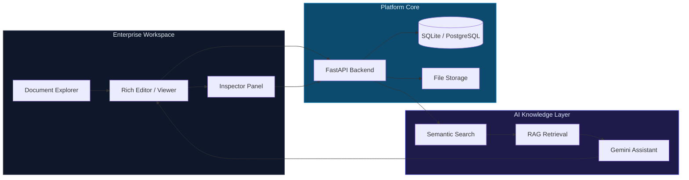
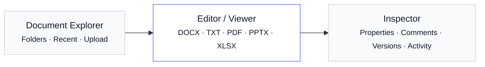
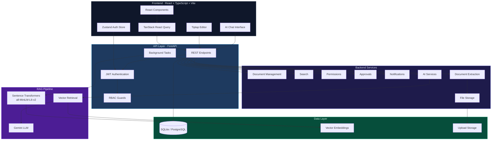
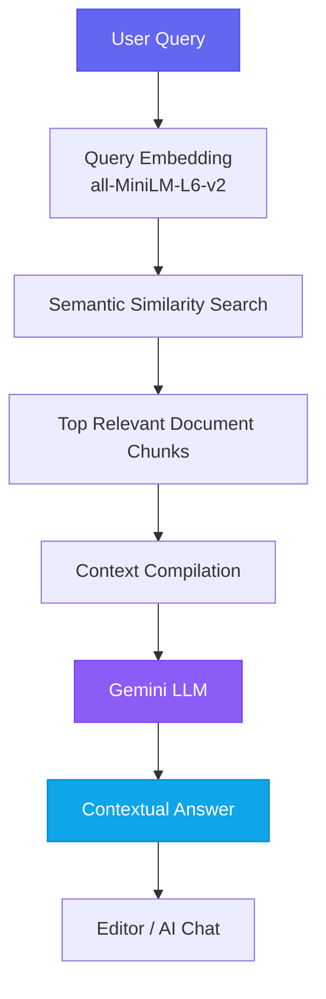

<div align="center">

# AI-Powered Enterprise<br/>Knowledge & Document Management System

**A modern enterprise knowledge platform for documents, organizational knowledge,<br/>permissions, approvals, and AI-powered retrieval.**

<br/>

[](https://react.dev/)
[](https://www.typescriptlang.org/)
[](https://fastapi.tiangolo.com/)
[](https://www.python.org/)
[](https://ai.google.dev/)
[]()
[](https://tiptap.dev/)
[](https://www.postgresql.org/)

<br/>

[Features](#features) · [Architecture](#architecture) · [AI](#ai-powered-knowledge-layer) · [Tech Stack](#tech-stack) · [Getting Started](#getting-started)

<br/>

**Repository:** [github.com/Riwitika/AI-Powered-Enterprise-Knowledge-Document-Management-System-DMS-](https://github.com/Riwitika/AI-Powered-Enterprise-Knowledge-Document-Management-System-DMS-)

</div>

---

> An AI-powered enterprise workspace that brings document management, structured knowledge, semantic search, role-based access, and intelligent document assistance into one unified platform.

---

## Platform Overview



---

## Features

<table>
<tr>
<td width="50%" valign="top">

### Enterprise Document Management
Hierarchical folders, multi-format uploads, favorites, archival, and full document lifecycle management across departments.

### Rich Document Editor
Paginated Tiptap editor with professional formatting, tables, images, links, and autosave — built for long-form corporate documents.

### AI Document Assistant
Ask questions, summarize content, improve writing, rewrite passages, and generate new text with document-aware context.

### RAG-Powered Knowledge Search
Semantic retrieval over embedded document chunks powers both search relevance and contextual AI responses.

</td>
<td width="50%" valign="top">

### Role-Based Access Control
Super Admin, Admin, Manager, Employee, and Guest roles with department-scoped and document-level permissions.

### Document Versioning
Automatic version history with manual checkpoints — track every meaningful change over time.

### Approval Workflows
Submit documents for review, approve or reject with remarks, and manage pending approvals from a dedicated dashboard.

### Permissions & Sharing
Grant view or edit access to users and departments with fine-grained document permission controls.

</td>
</tr>
<tr>
<td width="50%" valign="top">

### Document Processing
Background extraction, chunking, embedding, and AI summarization on every upload — originals preserved separately.

### Comments & Notifications
Threaded document comments and in-app notifications to keep teams aligned on document activity.

### Dashboard & Analytics
Organization overview with document metrics, recent activity, department insights, and AI usage signals.

### Semantic Search
Full-text and metadata search across documents, tags, categories, and departments.

</td>
<td width="50%" valign="top">

&nbsp;

</td>
</tr>
</table>

---

## Product Workspace

The application centers on a **three-panel document workspace** designed for focused enterprise work.



| Panel | Purpose |
| --- | --- |
| **Document Explorer** | Browse folder tree, open recent documents, upload files, and manage templates |
| **Editor / Viewer** | Rich Tiptap editing for DOCX/TXT; dedicated viewers for PDF, PPTX, and XLSX |
| **Inspector** | Document properties, threaded comments, version history, and activity timeline |

A floating **AI Assistant** panel is available globally — scoped to the active document or the full organization repository.

---

## Architecture



---

## AI-Powered Knowledge Layer

The platform uses **Retrieval-Augmented Generation (RAG)** to ground every AI response in your organization's actual document content — not generic model knowledge.



**Capabilities**

| Mode | What it does |
| --- | --- |
| Organization-wide Q&A | Search and answer across all accessible documents |
| Document-scoped Q&A | Restrict retrieval to a single open document |
| Summarization | Condense documents or selected passages |
| Explanation | Clarify complex terms and passages |
| Writing improvement | Enhance clarity, grammar, and structure |
| Rewrite / Shorten / Expand | Transform text while preserving intent |
| Tone transformation | Adjust to professional enterprise tone |
| Content generation | Create new content from instructions |

Gemini credentials are handled **exclusively on the backend** — the frontend never accesses API keys.

---

## Document Processing

Every upload triggers an automated background pipeline:


| Format | Extraction Library |
| --- | --- |
| PDF | PyMuPDF |
| DOCX | Mammoth + python-docx |
| PPTX | python-pptx |
| XLSX | openpyxl |
| Images | Pytesseract OCR |

Original uploaded files are always preserved. Extraction and indexing happen separately.

---

## Document Support

| Format | Capability |
| --- | --- |
| **TXT** | Rich text editing + extraction |
| **DOCX** | Rich Tiptap editing + extraction |
| **PDF** | In-browser viewing + extraction |
| **PPTX** | In-browser viewing + extraction |
| **XLSX** | In-browser viewing + extraction |
| **PNG / JPG** | Image viewing + OCR extraction support |

---

## Rich Document Editor

Built on **Tiptap / ProseMirror** with a print-style paginated canvas — one continuous document model presented as fixed page sheets.

<table>
<tr>
<td width="33%" valign="top">

**Layout**
- Fixed 920×1056 page sheets
- Automatic pagination
- Manual page breaks (`⌘↵` / `Ctrl↵`)
- Zoom & print preview

**Typography**
- Headings H1–H4
- Font family & size controls
- Bold · Italic · Underline · Strikethrough
- Text color & highlight

</td>
<td width="33%" valign="top">

**Structure**
- Bullet & numbered lists
- Nested lists & indent
- Alignment & justification
- Blockquotes & horizontal rules
- Line & paragraph spacing

**Media**
- Resizable images
- Hyperlinks
- Tables with row/column control

</td>
<td width="33%" valign="top">

**Workflow**
- Undo / Redo
- Autosave (debounced)
- Save checkpoint (version)
- Find & replace
- Word count

</td>
</tr>
</table>

---

## Security

| Layer | Implementation |
| --- | --- |
| Authentication | JWT access tokens with HTTP-only refresh cookies |
| Session management | Token refresh, blacklist on logout |
| Authorization | Role-based access control on every protected route |
| Passwords | bcrypt hashing via passlib |
| Document access | Owner, role, department, and explicit permission checks |
| AI credentials | Gemini API key stored in backend environment only |
| Configuration | Secrets loaded from `.env` — never committed to source control |

---

## Tech Stack

<table>
<tr>
<th>Frontend</th>
<th>Backend</th>
<th>AI & Search</th>
</tr>
<tr>
<td valign="top">


</td>
<td valign="top">


</td>
<td valign="top">


</td>
</tr>
<tr>
<th>Database</th>
<th>Document Processing</th>
<th>Tooling</th>
</tr>
<tr>
<td valign="top">

SQLite (development) · PostgreSQL + pgvector (production)

</td>
<td valign="top">

PyMuPDF · Mammoth · python-docx · python-pptx · openpyxl · Pytesseract · Pillow

</td>
<td valign="top">

pytest · GitHub Actions CI · Swagger OpenAPI docs

</td>
</tr>
</table>

---

## Project Structure

```
enterprise-kms/
├── frontend/          # React + TypeScript + Vite application
├── backend/           # FastAPI API, services, models, migrations
│   ├── app/
│   │   ├── api/       # REST route handlers
│   │   ├── services/  # RAG, extraction, storage, embeddings
│   │   └── models/    # SQLAlchemy ORM models
│   └── tests/         # Backend test suite
├── docs/              # Supplementary documentation
├── .github/           # CI workflow
└── README.md
```

---

## Getting Started

### Prerequisites

- **Python** 3.11+
- **Node.js** 20+
- **npm** 9+
- **Tesseract OCR** *(optional — for image text extraction)*

### Clone

```bash
git clone https://github.com/Riwitika/AI-Powered-Enterprise-Knowledge-Document-Management-System-DMS-.git
cd AI-Powered-Enterprise-Knowledge-Document-Management-System-DMS-
```

### Backend

```bash
cd backend
python3 -m venv venv
source venv/bin/activate          # Windows: venv\Scripts\activate
pip install -r requirements.txt
cp .env.example .env              # Set GEMINI_API_KEY and SECRET_KEY
uvicorn app.main:app --host 127.0.0.1 --port 8000 --reload
```

API docs: [http://localhost:8000/docs](http://localhost:8000/docs)

### Frontend

```bash
cd frontend
npm install
cp .env.example .env
npm run dev
```

Application: [http://localhost:5173](http://localhost:5173)

### Environment Variables

**Backend** (`backend/.env`)

| Variable | Description |
| --- | --- |
| `DATABASE_URL` | `sqlite:///./kms.db` for local dev |
| `SECRET_KEY` | JWT signing secret |
| `GEMINI_API_KEY` | Google Gemini API key |
| `GEMINI_MODEL` | Default: `gemini-1.5-flash` |
| `EMBEDDING_MODEL` | Default: `all-MiniLM-L6-v2` |

**Frontend** (`frontend/.env`)

| Variable | Description |
| --- | --- |
| `VITE_BACKEND_URL` | Default: `http://localhost:8000/api/v1` |

### Run Tests

```bash
# Backend
cd backend && source venv/bin/activate && python -m pytest

# Frontend build check
cd frontend && npm run build
```

---

## Demo Accounts

Seeded automatically on first backend startup:

| Name | Email | Password | Role |
| --- | --- | --- | --- |
| Arun Goyal | `superadmin@efasttrade.com` | `SuperAdmin@123` | Super Admin |
| Arnim Goyal | `admin@efasttrade.com` | `Admin@123` | Admin |
| Riwitika Gupta | `manager@efasttrade.com` | `Manager@123` | Department Manager |
| Paras Jain | `employee@efasttrade.com` | `Employee@123` | Employee |
| Yukti Gupta | `yukti@efasttrade.com` | `Employee@123` | Employee |
| Uttam Gupta | `uttam@efasttrade.com` | `Employee@123` | Employee |

New users can register with a `@efasttrade.com` email and invite code: **`FASTTRADE-SECURE-2026`**

---

## Contributors

<table>
<tr>
<td align="center" width="50%">
<br/>
<strong>Riwitika Gupta</strong><br/>
<sub>Developer</sub>
<br/><br/>
</td>
<td align="center" width="50%">
<br/>
<strong>Arnim Goyal</strong><br/>
<sub>Mentor</sub>
<br/><br/>
</td>
</tr>
</table>

---

## Project Status

> Core document management, AI assistance, RAG retrieval, authentication, document processing, rich editing, persistence, permissions, and workflow capabilities are implemented as part of this project.

---

## License

MIT License *(intended)* — a formal `LICENSE` file will be added to the repository.

---

<div align="center">

<br/>

**Fast Trade Technologies · Enterprise Knowledge Management**

<br/>

</div>
